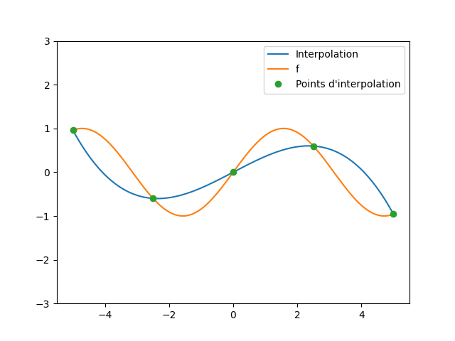

# Compte rendu TP2 - Interpolation polynomiale et base de Lagrange

## 1. Définition des variables

Premièrement, on doit choisir des entrées `a`, `b` et `n` pour créer une subdivision `X` de l'intervalle `[a,b]` en `n+1` points equidistants

```py
a = 0
b = 5 * numpy.pi
n = 5
N = 500
X = numpy.linspace(a, b, n)
```

Deuxièmement on va choisir une fonction `f` définit en tout points de la liste `X`, c'est à dire qui admet l'égalité `Yi = f(Xi)` pour `i` allant de 0 à `n`

```py
def f(x): return numpy.sin(x)
```

On travail sur la base de Lagrange c'est à dire


```py
# Base de Lagrange

def L(i, x, X):
    l = 1
    for j in range(n):
        if i != j:
            l *= (x - X[j]) / (X[i] - X[j])
    return l
```

## 2. Interpolation polynomiale

Après avoir traduit yi = P(xi), pour i allant de 0 à n, expliquer pourquoi ak = yk.

```py
# Fonction qui évalue le polynôme de Lagrange en x réel donné
def P(x, X, Y):
    p = 0
    for i in range(n):
        p += Y[i] * L(i, x, X)
    return p
```

## 3. Affichage

On va maintenant afficher la fonction `f` et le polynôme de Lagrange `P` sur l'intervalle `[a,b]` avec `N` points

```py
# Affichage

pyplot.plot(x, y, label='Interpolation')
pyplot.plot(x, f(x), label='f')
pyplot.plot(X, Y, 'o', label='Points d\'interpolation')
pyplot.ylim(-3, 3)
pyplot.legend()
pyplot.show()
```

### n = 5


### n = 10
