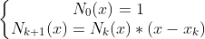
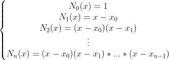
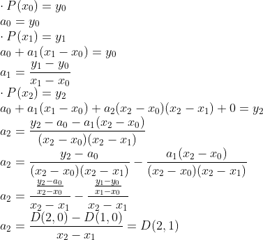
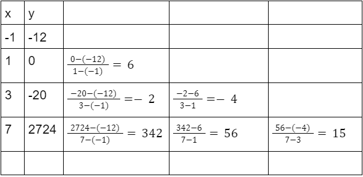
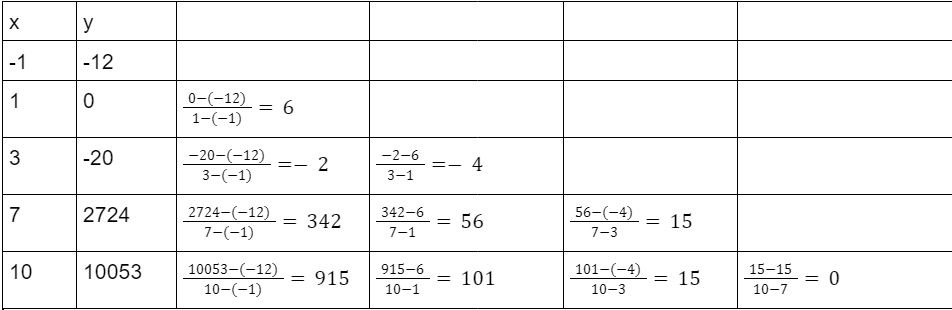
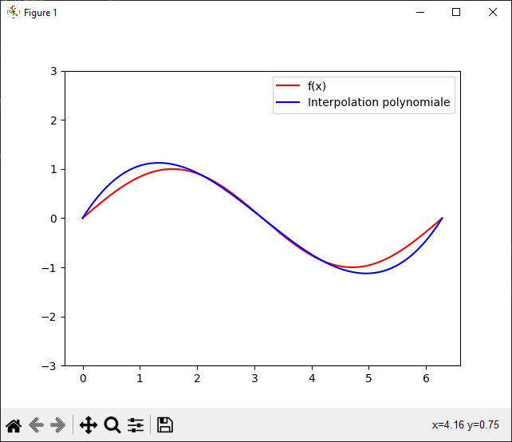
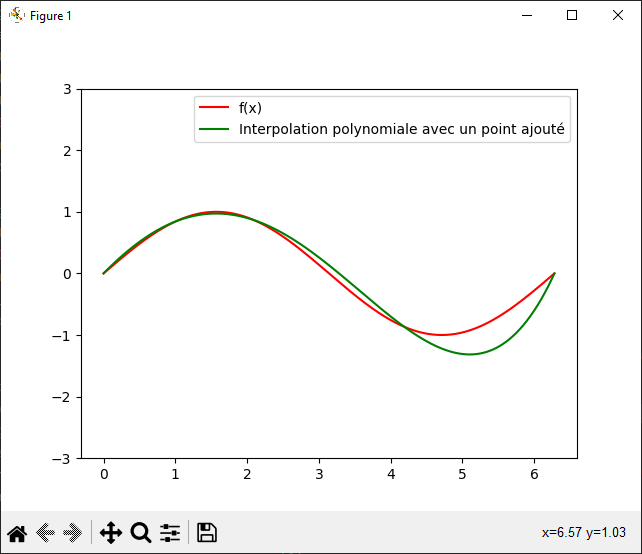
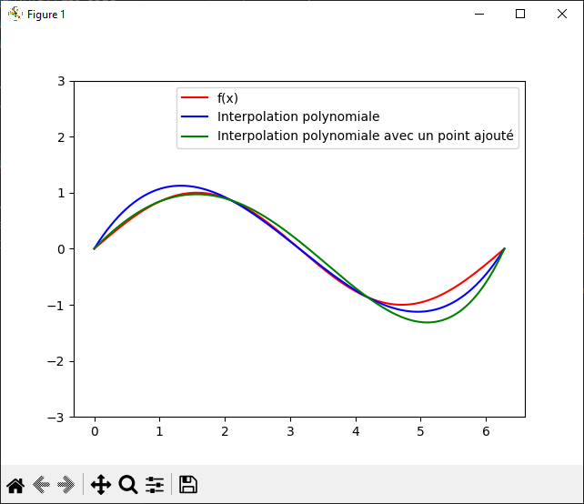

# Compte rendu TP3 - Interpolation polynomiale : Base de Newton

0) Définition de la base de Newton

et donc :

1) Traduction de yi=f(xi) pour i allant de 0 à n :

2) Rappel de la résolution par différences divisées

3) Ajoutons le point de coordonnées (10, 10053)

4) Tracer sur un même graphique une fonction f ainsi que son polynôme d’interpolation 
associé

Soit : 
- f(x) = sin(x)
- n = 4
- a = 0 et b = 2*pi

5) Après rajout du point (1, sin(1)) :

Comparaison des deux graphiques

voila.