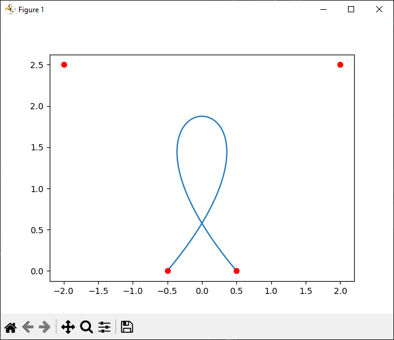
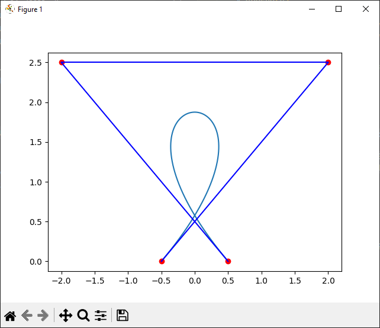

1. Fonction binomiale

On défini la fonction binomiale de deux entiers $n$ et $p$ par la formule suivante:


```python
import math

def binom(n, p):
    return math.factorial(n)/(math.factorial(p)*math.factorial(n-p))
```

2. Fonction de bernstein

On définit la fonction de bernstein de deux entiers $n$ et $p$ par la formule suivante:


```python
import math

def bernstein(n, i, t):
    return binom(n, i)*(t**i)*((1-t)**(n-i))
```

3. Fonction de bezier

On définit la fonction de bezier qui retourne une liste de N points de la courbe de Bezier désirée


```python
import math

def bezier(points):
    n = len(points)
    x = []
    y = []
    for t in numpy.linspace(0, 1, 100):
        x.append(0)
        y.append(0)
        for i in range(n):
            x[-1] += bernstein(n-1, i, t)*points[i][0]
            y[-1] += bernstein(n-1, i, t)*points[i][1]
    return (x, y)
```

4. Affichage de la courbe de Bezier

```python
import matplotlib.pyplot as plt

def show(points):
    x, y = bezier(points)
    pyplot.plot(x, y)
    for i in range(len(points)):
        pyplot.plot([points[i][0]], [points[i][1]], 'ro')
    pyplot.show()

show((-0.5, 0), (2, 2.5), (-2, 2.5), (0.5, 0))
```



Ajout des lignes brisées

```python
import matplotlib.pyplot as plt

def show(points):
    x, y = bezier(points)
    pyplot.plot(x, y)
    for i in range(len(points)):
        pyplot.plot([points[i][0]], [points[i][1]], 'ro')
        if i > 0:
            pyplot.plot([points[i-1][0], points[i][0]],
                        [points[i-1][1], points[i][1]], 'b-')
    pyplot.show()

show((-0.5, 0), (2, 2.5), (-2, 2.5), (0.5, 0))
```



voilà.