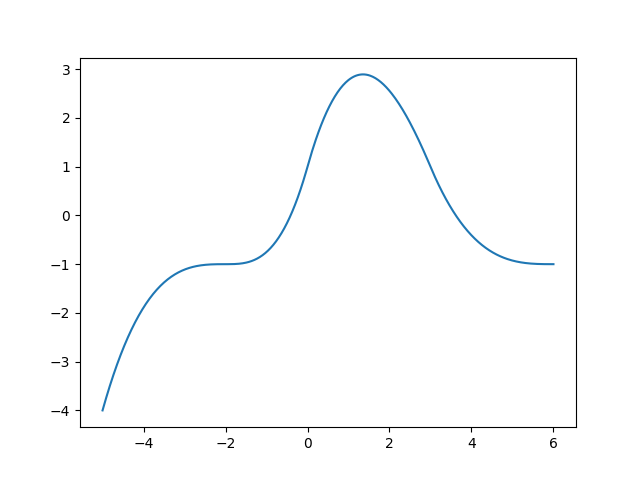
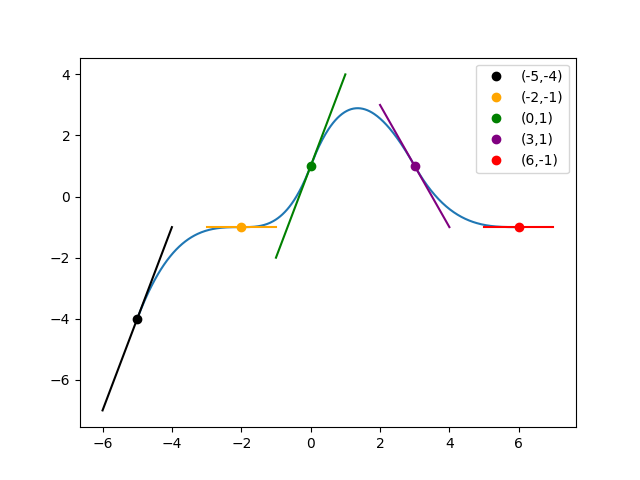

# Compte rendu TP5 - Interpolation polynomiale : Base d'Hermite

## I. Base d'Hermite

|   |  |  |  |  |
|---|---|---|---|---|
|  | 1 | 0 | 0 | 0 |
|  | 0 | 1 | 0 | 0 |
|  | 0 | 0 | 1 | 0 |
|  | 0 | 0 | 0 | 1 |

On obtient:


Allure des courbes de la base d'Hermite:


1. On cherche un polynome P de degré 3 tel que :


car


1. On cherche un polynome P de degré 3 qui passe par deux points A et B et dont on connaît les dérivées VA et VB en XA et XB.


On pose 


car


Exemple:


3. Faire la même chose

Soit


alors


Soit


alors


Soit


alors


## II. Interpolation polynomiale

1. On écrit les fonction phi1, phi2, phi3, phi4 nulles en dehor de l'intervalle [0,1]:

```python
def phi1(x):
    return 0 if x < 0 or x > 1 else (x-1)**2*(1+2*x)


def phi2(x):
    return 0 if x < 0 or x > 1 else x**2*(3-2*x)


def phi3(x):
    return 0 if x < 0 or x > 1 else x*(x-1)**2


def phi4(x):
    return 0 if x < 0 or x > 1 else (x-1)*x**2
```

2. Stockage des tableaux X,Y et V:

```python
X = [-5, -2, 0, 3, 6]
Y = [-4, -1, 1, 1, -1]
V = [3, 0, 3, -2, 0]
```

3. Ecriture de foncHermite qui renvoie le polynome de Hermite:

```python
def foncHermite(X, Y, V, x):
    n = len(X)
    P = 0
    for k in range(n-1):
        d = X[k+1]-X[k]
        t = (x-X[k])/d
        P += Y[k] * phi1(t) + Y[k+1]*phi2(t) + d*(V[k]*phi3(t)+V[k+1]*phi4(t))
    return P
```

4. Affichage de la courbe représentative de P:

```python
import numpy
import matplotlib.pyplot as pyplot

x = numpy.linspace(X[0], X[-1], 500)
pyplot.plot(x, [foncHermite(X, Y, V, i) for i in x])
pyplot.show()
```



5. Ajout des tangentes:

```python
import numpy
import matplotlib.pyplot as pyplot

x = numpy.linspace(0, 10, 500)
pyplot.plot(x, [foncHermite(X, Y, V, i) for i in x])
for k in range(len(X)):
    pyplot.plot((X[k]-1, X[k]+1), (Y[k]-V[k], Y[k]+V[k]))
pyplot.show()
```



voila.