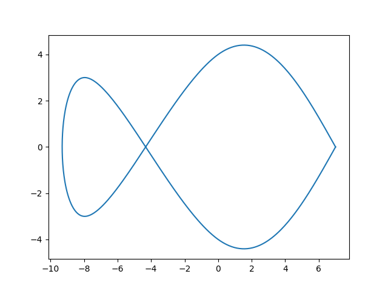

# Compte rendu TP6 - Splines cubiques naturelles uniformes

## 0. Entrées et Imports

```python
import numpy
import matplotlib.pyplot as pyplot

X = [7, 0, -8, -8, 0, 7]
Y = [0, 4, -3, 3, -4, 0]
T = [0, 1, 2, 3, 4, 5]
```

## 1. On reconstitue le vecteur B


```python
def vecteurB(Y):
    Z = numpy.zeros(len(Y), dtype=int)
    for k in range(1, len(Y)-1):
        Z[k] = 3*(Y[k+1]-Y[k-1])
    Z[0] = 3*(Y[1]-Y[0])
    Z[-1] = 3*(Y[-1]-Y[-2])
    return Z

Bx = vecteurB(X)
By = vecteurB(Y)
```

## 2. On reconstitue la matrice S

diag=[2,4,4......,2]  
sur_diag et sous_diag constituées de 1

```python
def matriceS(n):
    diag = numpy.zeros(n, dtype=int)
    diag.fill(4)
    diag[0] = 2
    diag[-1] = 2
    sur_sous_diag = numpy.zeros(n-1, dtype=int)
    sur_sous_diag.fill(1)
    S = numpy.diag(diag) + numpy.diag(sur_sous_diag, k=1) + numpy.diag(sur_sous_diag, k=-1)
    return S

S = matriceS(len(X))
```

## 3. On résout les équations matricielles :  et 

```python
Xp = numpy.linalg.solve(S, Bx)
Yp = numpy.linalg.solve(S, By)
```

## 4. On réutilise les fonctions Hermite du [TP5](https://github.com/RajPorus19/tps-algebre/tree/main/TP5) et on trace les courbes

```python
x = numpy.linspace(T[0], T[-1], 500)
Xaff = [foncHermite(T, X, Xp, t) for t in x]
Yaff = [foncHermite(T, Y, Yp, t) for t in x]
pyplot.plot(Xaff, Yaff)
pyplot.show()
```



voila.