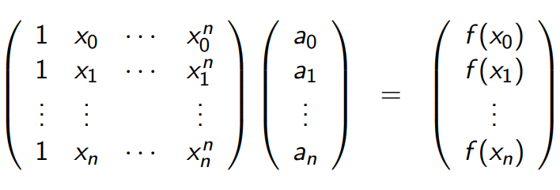
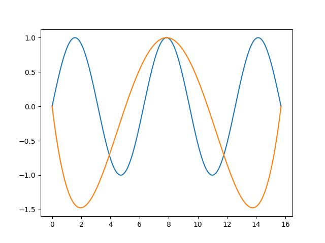
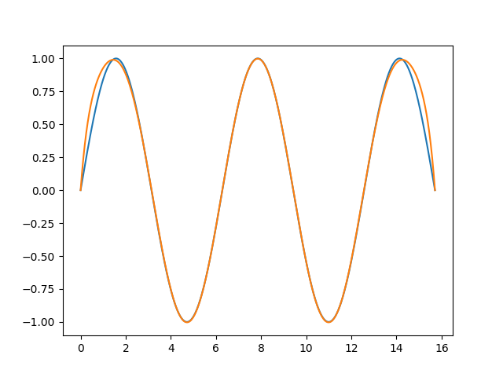
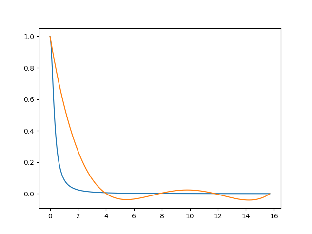
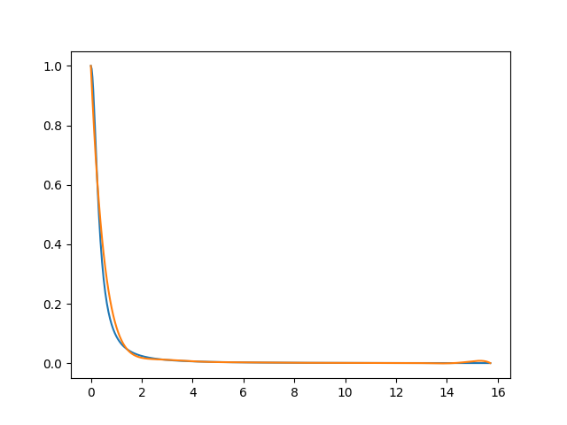

# Compte rendu TP1 - Interpolation polynomiale et base canonique

## 1. Définition des variables

Premièrement, on doit choisir des entrées `a`, `b` et `n` pour créer une subdivision `X` de l'intervalle `[a,b]` en `n+1` points equidistants

```py
a = 0
b = 5 * numpy.pi
n = 5
N = 500
X = numpy.linspace(a, b, n)
```

Deuxièmement on va choisir une fonction `f` définit en tout points de la liste `X`, c'est à dire qui admet l'égalité `Yi = f(Xi)` pour `i` allant de 0 à `n`

```py
def f(x): return numpy.sin(x)

# Matrice de Vandermonde
V = numpy.vander(X, increasing=True)

# Matrice verticale Yi = f(Xi)
Y = f(X)
```

On a donc le système matriciel suivant avec `A` la matrice verticale des coefficients du polynome:

(S) : V A = Y



## 2. Résolution et évalutaion de l'erreur

Tout d'abord on résout le système précédent avec une fonction de numpy :

```py
# Coefficients du polynome
A = numpy.linalg.solve(V, Y)
```

Ainsi, `A` contient la liste des cofficients du polynôme qu'on peut maintenant évaluer facilement pour tout `x` appartenant à `[a,b]` :

```py
def Polynome(x):
    s = 0
    for k in range(n):
        s += A[k] * x**k
    return s

r = [Polynome(x) for x in Xaff]
```

Aussi, il nous est possible de trouver la plus grande erreur entre l'interpolation polynomiale et la fonction qu'on tente d'approcher:

```py
def Erreur():
    tab = [numpy.abs(Polynome(Xaff[i]) - f(Xaff[i])) for i in range(N)]
    return numpy.max(tab)
```

## 3. Affichage et interprétation des résultats

A l'aide de pyplot : 

```py
pyplot.plot(Xaff, f(Xaff), label="f")
pyplot.plot(Xaff, [Polynome(x) for x in Xaff], label="P")
pyplot.show()
```

Finalement, au premier affichage, donc pour rappel :

```py
a = 0
b = 5 * numpy.pi
n = 5
N = 500
def f(x): return numpy.sin(x)
```

On obtient une interpolation linéaire peu convaicante avec une `erreur` max d'environ 1.4 :


- bleu : fonction f
- rouge : polynome

Alors on peut décider d'augmenter la valeur de `n` pour s'approcher au maximum de la fonction `f`

Pour `n = 12` `erreur` max environ 0.2 :



On peut donc conclure que `n` qui controle le nombre de subdivision de l'intervalle de recherche `[a,b]` et donc sur la précision de l'interpolation polynomiale puisque il sera de degré au maximum égal à `n`.

Plus `n` sera grand plus la solution `(S) V A = Y` comportera de coefficients pour approcher le polynome à la fonction souhaitée.

---

Même étude pour 
```py
a = 0
b = 5 * numpy.pi
n = 5
N = 500
#f : x -> 1/(1 + 10 * x ** 2)
def f(x): return [1/(1 + 10 * i ** 2) for i in x] if type(x) == list else 1/(1 + 10 * x ** 2)
```
### n = 5, erreur max 0.5



### n = 12, erreur max 0.08

